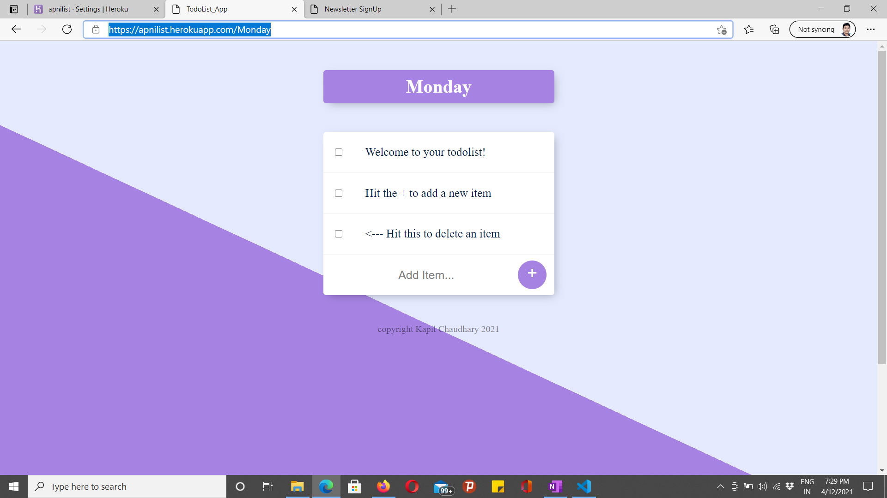
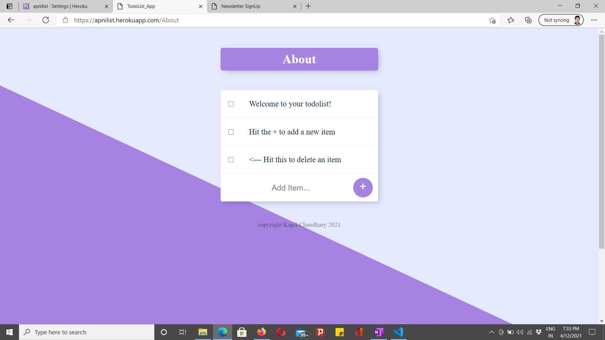
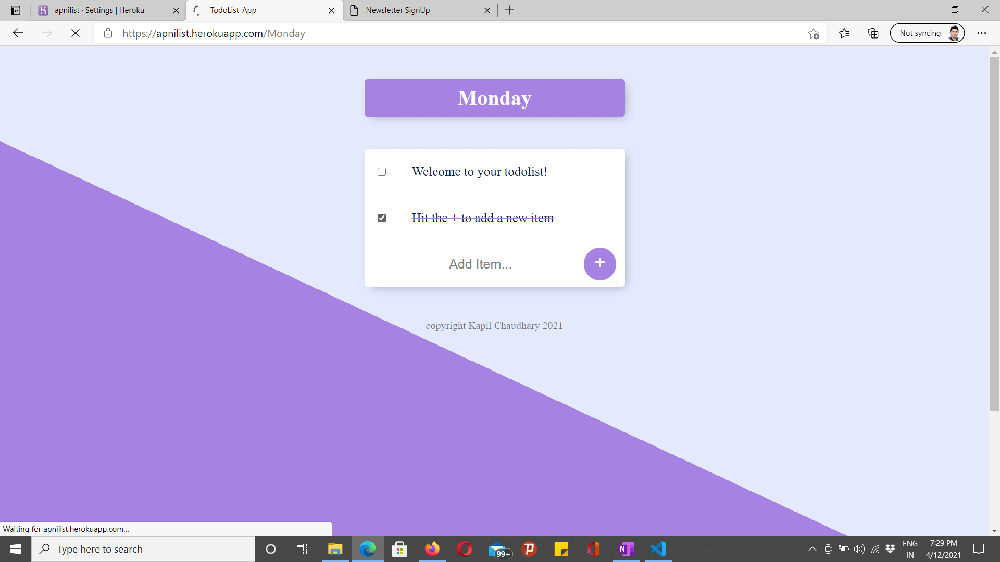

# ApniList
Apni List is a fullstack Dynamic ToDo List Application Which Supports Infinite ToDos.

So This Apni List Application is Deployed at [Apni List](https://apnilist.herokuapp.com/).
It is deployed on heroku.

What I learnt While making this Application
Or You Can Say What tech I have used 

1. JavaScript for frontend 
2. Node js for Server Side
3. HTML and CSS for Structuring and Desigining
4. NO-SQL Based Database # MongoDB
5. Using MongoDB Atlas for hosting the Database
6. EJS (Embedded JavaScript) in HTML for Reducing the Code base and Redudant HTML Data.

Here Are Some Photos How It Looks : 

## Custom Dynamic Routing for Infinite Routes With Different Data

## Checkbox to Delete from all the Three 
## Frontend
## Express Server
## Mongodb Database

